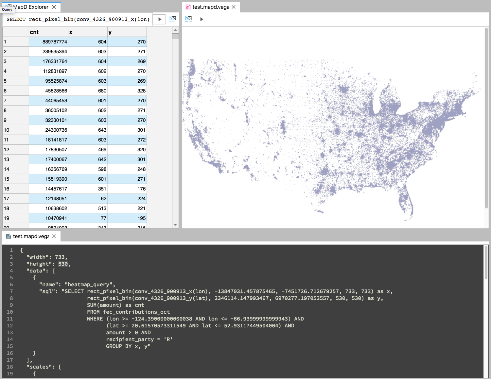
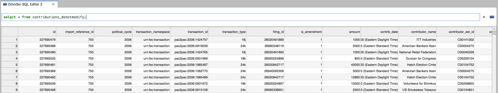

# jupyterlab-omnisci

Connect to OmniSci, query their databases, and render the OmniSci-flavored Vega specification,
all within JupyterLab.

[](https://pypi.python.org/pypi/jupyterlab-omnisci) [](https://www.npmjs.com/package/jupyterlab-omnisci)

[](https://mybinder.org/v2/gh/Quansight/jupyterlab-omnisci/master?urlpath=lab/tree/notebooks/4.%20Extract%20Use%20Cases%20-%20VL%20examples.ipynb)



## Installation

First, install JupyterLab and `pymapd` as well the `jupyterlab-omnisci` Python package:

```bash
conda install -c conda-forge pymapd nodejs

pip install jupyterlab-omnisci
```

Then install the `jupyterlab-omnisci` JupyterLab extension:

```bash
jupyter labextension install @jupyter-widgets/jupyterlab-manager --no-build
jupyter labextension install jupyterlab-omnisci
```

Then launch JupyterLab:

```bash
jupyter lab
```

## Executing SQL Queries

You can open an OmiSci SQL editor by going to **File > New > OmniSci SQL Editor** or clicking the icon on the launcher.

Input your database credentials by clicking on the blue icon on the right:


Then you can input an SQL query and hit the triangle to see the results:



To set a default connection that will be saved and used for new editors, go to **Settings > Set Default Omnisci Connection...**.

## Getting started with Ibis

Once you have set a default connection, you can run the **Inject Ibis OmniSci Connection** command to prefil a cell to connect to it with Ibis.


## Creating Visualizations

Check out the [introduction notebook](./notebooks/Introduction.ipynb) to see how to use OmniSci within your notebooks [](https://mybinder.org/v2/gh/Quansight/jupyterlab-omnisci/master?urlpath=lab/tree/notebooks/Introduction.ipynb).

## Using session IDs

In some contexts the user may be coming from another context (such as OmniSci Immerse)
where they already have an authenticated session to the OmniSci databse.
This extension provides a way to pass that session information to JupyterLab so that they
may continue with their data analysis uninterrupted.
There are some steps required to set this up, however:

#### 1. Enable the session manager server extension.

We must an extension to the JupyterLab server that knows how to find the session
information, which can then be passed to the frontend application.
Once the package `jupyterlab_omnisci` is installed, the extension can be enabled by running

```bash
jupyter serverextension enable --sys-prefix jupyterlab_omnisci.serverextension
```

If this works, you should not see any error messages, and you can verify
it is enabled by running

```bash
jupyter serverextension list
```

#### 2. Set up the user's environment

The user environment should be prepared for the extension to get the necessary information.
This setup could occur during a container launch, or after spawning the Jupyter server process.
By default, the extension looks for the protocol, host, and port of the OmniSci server
in environment variables.
The names of these variables may be configured in the user's `jupyter_notebook_config.py`:

```python
c.OmniSciSessionManager.protocol = 'OMNISCI_PROTOCOL'
c.OmniSciSessionManager.host = 'OMNISCI_HOST'
c.OmniSciSessionManager.port = 'OMNISCI_PORT'
```

The session ID is more ephemeral. The extension looks for that information in a file on disk.
This file should be plain text, and contain the session ID and nothing else.
The location of this file _must_ be configured in the `jupyter_notebook_config.py` file,
otherwise it won't know where to find the session:

```python
c.OmniSciSessionManager.session_file = '/path/to/session/file'
```

#### 3. Directing the user to the session

Once the server extension is enabled, and the user's environment is configured,
it should be ready to use.
You can direct the user to a workspace that is ready-to-use by sending them
to this url (where `BASE_URL` is the server root):

```
{BASE_URL}/lab?omnisci&reset
```

The `omnisci` URL parameter launches a few activities with the session ID that should be ready-to-go.
The `reset` URL parameter clears any existing workspace that would try to load,
since we are replacing it with our own.
If everything has worked, you should see something like the following:


#### 4. Advanced configuration

The `OmniSciSessionManager` is the default provider of session IDs,
but this can be configured and replaced by other implementations.
For instance, if you want to get connection data from another location
other than environment variables and local files, you can replace it with your
own implementation.

To do this, you need to write a new session manager that implements the interface
given in [this](./jupyterlab_omnisci/serverextension/session.py) file,
and configure the notebook server to use that in the `jupyter_notebook_config.py`:

```python
c.OmniSciConfig.session_manager = "your_new_module.YourImplementation"
```

## FAQ

1. Something isn't working right. What should I do?
   _[Open an issue!](https://github.com/Quansight/jupyterlab-omnisci/issues/new?assignees=&labels=bug&template=bug_report.md&title=%5BBUG%5D+) It's likely not your fault, many of these integrations are new and we need your feedback to understand what use cases are important_.

## Installing from source

To install from source, run the following in a terminal:

```bash
git clone git@github.com:Quansight/jupyterlab-omnisci.git

cd jupyterlab-omnisci
conda env create -f binder/environment.yml
conda activate jupyterlab-omnisci

jlpm install
jlpm run build

jupyter labextension install @jupyter-widgets/jupyterlab-manager --no-build
jupyter labextension install .
jupyter serverextension enable --sys-prefix jupyterlab_omnisci.serverextension
```

## Releasing

First create a test environment:

```bash
conda create -n tmp -c conda-forge pymapd nodejs
conda activate tmp
```

Then bump the Python version in `setup.py` and upload a test version:

```bash
pip install --upgrade setuptools wheel twine
rm -rf dist/
python setup.py sdist bdist_wheel
twine upload --repository-url https://test.pypi.org/legacy/ dist/*
```

Install the test version in your new environment:

```bash
pip install --index-url https://test.pypi.org/simple/ --extra-index-url https://pypi.org/simple jupyterlab_omnisci
```

Now bump the version for the Javascript package in `package.json`. The run a build,
create a tarball, and install it as a JupyterLab extension:

```bash
yarn run build
yarn pack --filename out.tgz
jupyter labextension install @jupyter-widgets/jupyterlab-manager@0.40.x --no-build
jupyter labextension install out.tgz
```

Now open JupyterLab and run through all the notebooks in `notebooks` to make sure
they still render correctly.

Now you can publish the Python package:

```bash
twine upload dist/*
```

And publish the node package:

```
npm publish out.tgz
```
