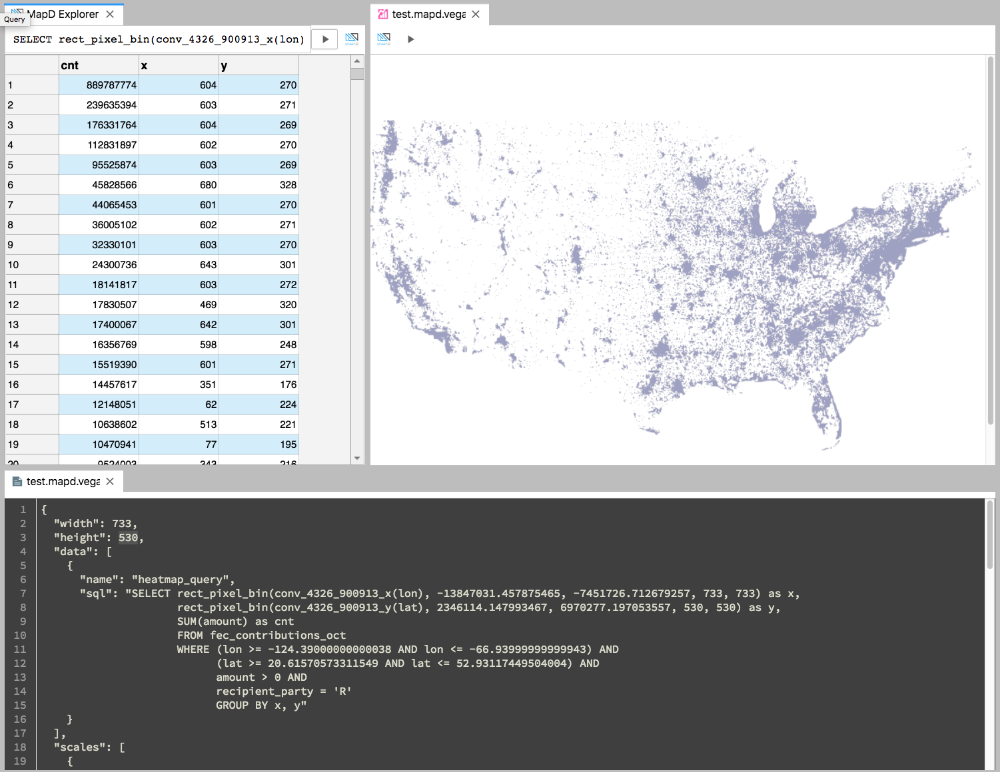

# JupyterLab OmniSci

Connect to OmniSci, query their databases, and render the OmniSci-flavored Vega specification,
all within JupyterLab.

## FAQ

1. Something isn't working right. What should I do?
   _[Open an issue!](https://github.com/omnisci/jupyterlab-omnisci/issues/new?assignees=&labels=bug&template=bug_report.md&title=%5BBUG%5D+) It's likely not your fault, many of these integrations are new and we need your feedback to understand what use cases are important_.
