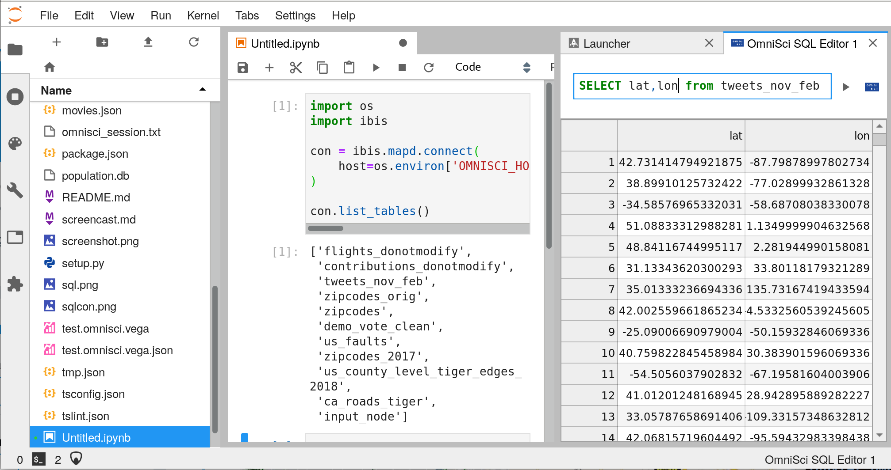

# Using session IDs

In some contexts the user may be coming from another context (such as HeavyAI Immerse)
where they already have an authenticated session to the HeavyAI databse.
This extension provides a way to pass that session information to JupyterLab so that they
may continue with their data analysis uninterrupted.
There are some steps required to set this up, however:

## 1. Enable the session manager server extension.

We must an extension to the JupyterLab server that knows how to find the session
information, which can then be passed to the frontend application.
Once the package `jupyterlab_heavyai` is installed, the extension can be enabled by running

```bash
jupyter serverextension enable --sys-prefix jupyterlab_heavyai.serverextension
```

If this works, you should not see any error messages, and you can verify
it is enabled by running

```bash
jupyter serverextension list
```

## 2. Set up the user's environment

The user environment should be prepared for the extension to get the necessary information.
This setup could occur during a container launch, or after spawning the Jupyter server process.
By default, the extension looks for the protocol, host, and port of the HeavyAI server
in environment variables.
The names of these variables may be configured in the user's `jupyter_notebook_config.py`:

```python
c.HeavyAISessionManager.protocol = 'HEAVYAI_PROTOCOL'
c.HeavyAISessionManager.host = 'HEAVYAI_HOST'
c.HeavyAISessionManager.port = 'HEAVYAI_PORT'
```

The session ID is more ephemeral. The extension looks for that information in a file on disk.
This file should be plain text, and contain the session ID and nothing else.
The location of this file _must_ be configured in the `jupyter_notebook_config.py` file,
otherwise it won't know where to find the session:

```python
c.HeavyAISessionManager.session_file = '/path/to/session/file'
```

## 3. Directing the user to the session

Once the server extension is enabled, and the user's environment is configured,
it should be ready to use.
You can direct the user to a workspace that is ready-to-use by sending them
to this url (where `BASE_URL` is the server root):

```
{BASE_URL}/lab?heavyai&reset
```

The `heavyai` URL parameter launches a few activities with the session ID that should be ready-to-go.
The `reset` URL parameter clears any existing workspace that would try to load,
since we are replacing it with our own.
If everything has worked, you should see something like the following:



## 4. Advanced configuration

The `HeavyAISessionManager` is the default provider of session IDs,
but this can be configured and replaced by other implementations.
For instance, if you want to get connection data from another location
other than environment variables and local files, you can replace it with your
own implementation.

To do this, you need to write a new session manager that implements the interface
given in [this](https://github.com/heavyai/jupyterlab-heavyai/blob/main/jupyterlab_heavyai/serverextension/session.py) file,
and configure the notebook server to use that in the `jupyter_notebook_config.py`:

```python
c.HeavyAIConfig.session_manager = "your_new_module.YourImplementation"
```
