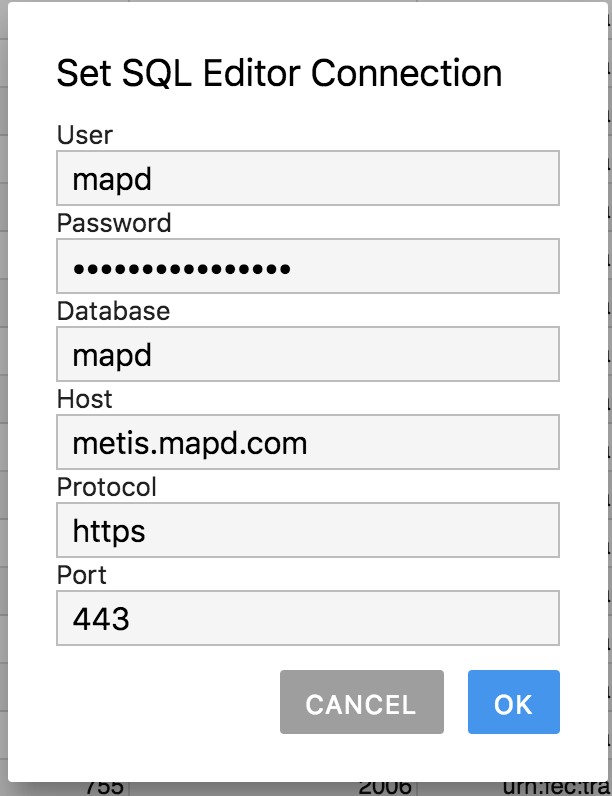
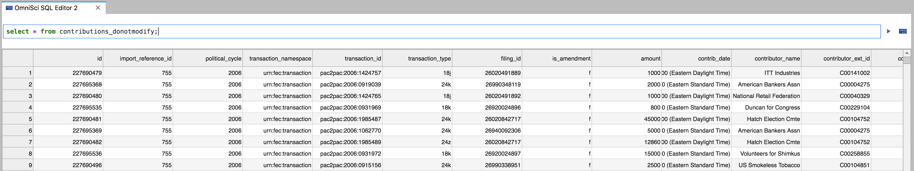
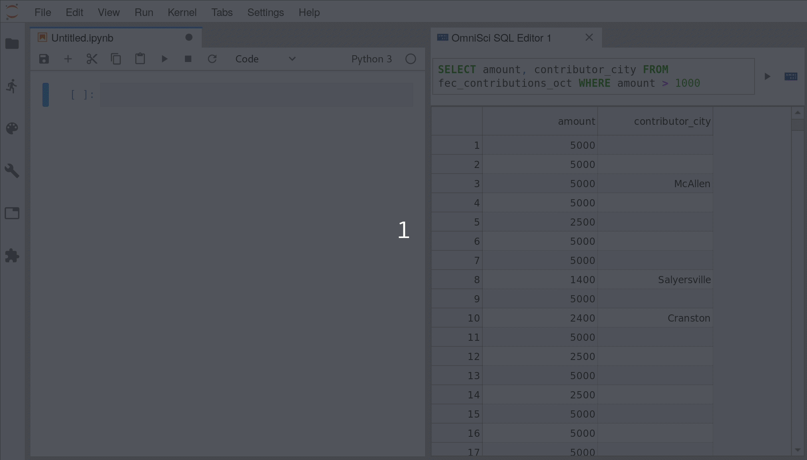

# Standalone SQL Editor

You can open an OmiSci SQL editor by going to **File > New > OmniSci SQL Editor** or clicking the icon on the launcher.

Input your database credentials by clicking on the blue icon on the right:

Then you can input an SQL query and hit the triangle to see the results:

To set a default connection that will be saved and used for new editors, go to **Settings > Set Default Omnisci Connection...**.

## Ibis

Once you have set a default connection, you can run the **Inject Ibis OmniSci Connection** command to prefil a cell to connect to it with Ibis.

